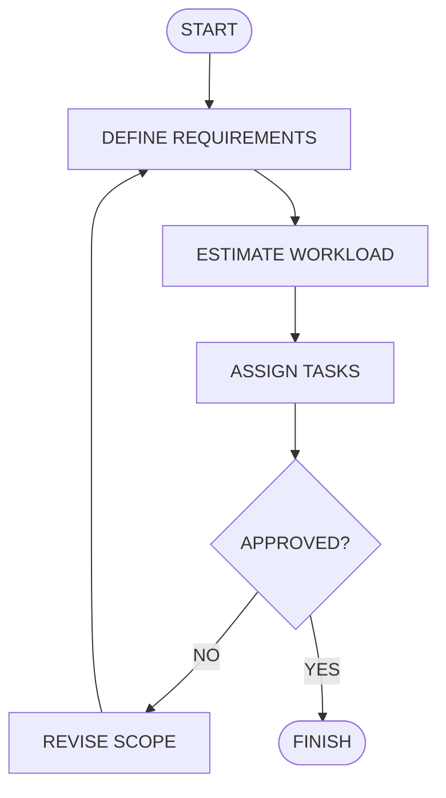

# Singing Rater — Build Workflow

How the companion's pitch-matching minigame actually got built, mapped onto a
standard requirements → estimate → assign → approval-loop → finish flowchart.

## Stage by stage

**DEFINE REQUIREMENTS**
A companion feature (not a standalone tool): the companion plays a short
reference melody, records the player singing it back over the mic, and gives a
score + spoken feedback — reusing the existing dialogue/expression pipeline
rather than a separate UI.

**ESTIMATE WORKLOAD**
Four pieces, ordered cheapest/most-certain first: (1) a pure pitch-detection
algorithm — no Unity dependency, testable with synthetic sine waves; (2) a
scorer comparing a recording against a reference melody; (3) Unity-side
orchestration (play tones, record mic, run the scorer); (4) wiring into the
companion's existing turn loop and key bindings.

**ASSIGN TASKS**
| Task | File |
|---|---|
| Autocorrelation pitch detection | `Assets/Scripts/Companion/Singing/PitchDetector.cs` |
| Reference melody data | `Assets/Scripts/Companion/Singing/ReferenceMelody.cs` |
| Windowed scoring vs. reference | `Assets/Scripts/Companion/Singing/SingingScorer.cs` |
| Tone playback + mic recording | `Assets/Scripts/Companion/Singing/SingingRaterService.cs` |
| Trigger + feedback wiring | `CompanionController.cs` (key **K**) |
| Synthetic-signal tests | `Assets/Tests/PlayMode/SingingRaterTests.cs` |
| Real-hardware smoke test | `Assets/Tests/PlayMode/SingingRaterLiveSmokeTest.cs` |

**APPROVED? — first pass: NO**
The first live-hardware test run failed with a `MissingComponentException` —
`SingingRaterService`'s `Awake()` used a `GetComponent<AudioSource>() ??
AddComponent<AudioSource>()` one-liner that intermittently left `audioSource`
unset before `PlayReferenceMelodyAsync` tried to use it.

**REVISE SCOPE**
Rewrote `Awake()` as two explicit null checks instead of the `??` one-liner.
Re-ran the exact same live test twice in a row to confirm it wasn't a fluke.

**APPROVED? — second pass: YES**
All 8 synthetic-signal tests passed (known-frequency detection, silence
rejection, perfect-pitch scoring >90, octave-off scoring <20, feedback/
expression band mapping), and the live smoke test completed cleanly against
real hardware — reference melody actually played, real microphone actually
recorded, real score computed (0, correctly, since nothing was sung).

**FINISH**
Feature is in `CompanionBootstrap`, triggered with **K** in Play mode,
covered by both synthetic and live tests.
